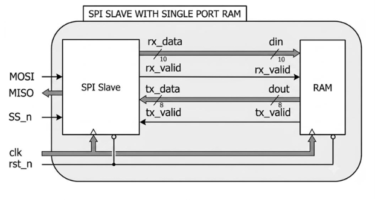
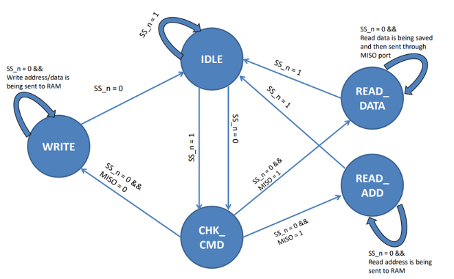
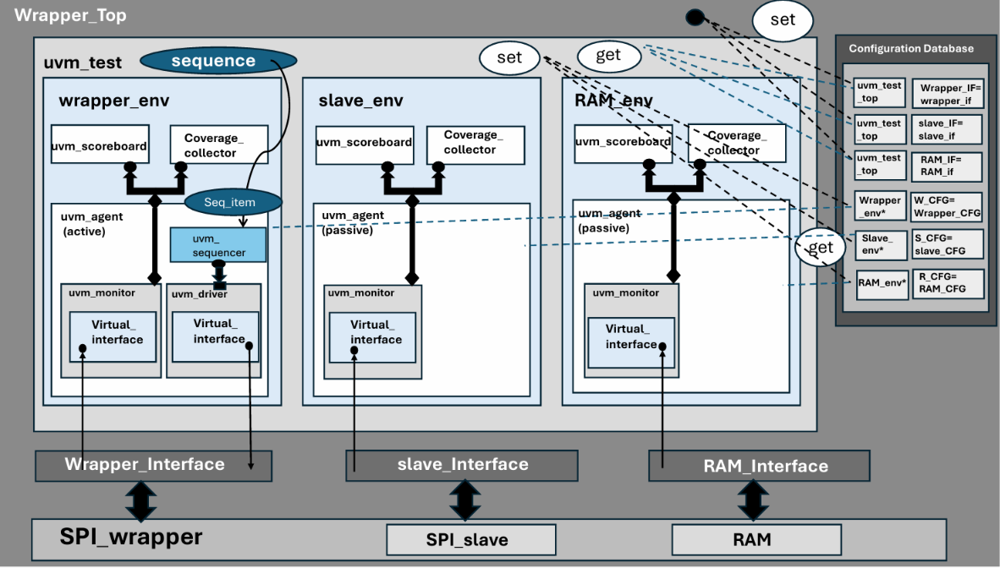

# Integrated SPI Slave with Single-Port RAM — Design & UVM Verification Architecture

This project implements an SPI Slave with Single-Port RAM Interface wrapped inside a top-level module (SPI_wrapper). The primary objective is to allow an external SPI Master to communicate serially with an on-chip 256x8-bit single-port synchronous memory.The SPI Slave interface deserializes incoming 11-bit serial command packets received on the MOSI line into 10-bit parallel frames (rx_data), controls internal handshaking with the RAM, and serializes requested memory data back to the Master via the MISO line
---

## 1.Design Phase 

### System Top Architecture (`SPI_wrapper`)

---

### 1. Top-Level Interconnects (SPI_wrapper)

* **External Interface**: Accepts MOSI, SS_n, clk, and rst_n as inputs and outputs serial data on MISO.  
* **Internal Interconnects**:
    * `rx_data`: connected to RAM din[9:0] 
    * `rx_valid`": connected to RAM rx_valid control signal  
    * `dout` : connected to SPI Slave tx_data[7:0].  
    * `tx_valid`: connected to SPI Slave tx_valid control signal

### 2. Single-Port Synchronous RAM Block (synch_ram)

* **Parameters**: Configured with a default memory depth of 256 words (MEM_DEPTH = 256) and an 8-bit address space (ADDR_SIZE = 8).  
* **Command **Operation**: Decodes the 2 most significant bits of the 10-bit input vector din[9:8] when rx_valid is asserted HIGH:  
    * `2'b00 (Write Address)`: Holds din[7:0] internally in a dedicated register as the active write address.  
    * `2'b01 (Write Data)`: Writes din[7:0] into memory location specified by the previously stored write address.  
    * `2'b10 (Read Address)`: Holds din[7:0] internally in a dedicated register as the active read address.  
    * `2'b11 (Read Data)`: Reads memory contents from the stored read address, places data onto dout[7:0], and asserts tx_valid HIGH to inform the SPI Slave.

### 3. SPI Slave Controller (SPI_slave)
The SPI Slave handles protocol frame synchronization, serial-to-parallel input conversion (`MOSI`), and parallel-to-serial output conversion (`MISO`).

* **Fininte state machine**: 

    * Driven by a 5-state FSM:
    * `IDLE`: Default state on reset (rst_n = 0) or when Master is inactive (SS_n = 1).  
    * `CHK_CMD`: Entered when SS_n transitions to 0. Examines the first bit received on MOSI to distinguish between write (MOSI = 0) and read (MOSI = 1) operations. 
    * `WRITE`: Converts 10 incoming bits on MOSI serially to parallel (rx_data[9:0]) over 10 clock cycles. Asserts rx_valid HIGH to signal the RAM block. Handles both Write Address (00) and Write Data (01) frames.  
    * `READ_ADD`: Receives 10 serial bits on MOSI corresponding to the Read Address frame (10), converts them to parallel (rx_data[9:0]), and asserts rx_valid HIGH.  
    * `READ_DATA`: Ignores incoming dummy bits on MOSI, waits for the RAM to assert tx_valid, loads tx_data[7:0], and streams data out serially bit-by-bit on MISO starting with the MSB.  
* **Serial Receive Stream (`MOSI`)**: Shifts 10 bits serially into `rx_data[9:0]`. When 10 bits are fully ingested, `rx_valid` pulses high to notify the RAM.
* **Serial Transmit Stream (`MISO`)**: When the memory asserts `tx_valid`, the slave latches the 8-bit `tx_data[7:0]` (`dout`) and shifts it out bit-by-bit on the `MISO` line.
* **Frame Boundary Control (`SS_n`)**: Driving `SS_n` high immediately aborts any active transaction, forces internal shift counters to zero, and returns the FSM to `IDLE`.

## 2. UVM Verification Phase

The verification environment is built on UVM to systematically validate the design using constrained-random generation, SystemVerilog Assertions (SVA), reference modeling, and functional cross-coverage. The verification execution phase is divided into three main milestone steps:
1. **Constructing & Verifying the RAM UVM Sub-Environment**
2. **Constructing & Verifying the SPI_slave UVM Sub-Environment**
3. **Constructing & Verifying the Full Top-Level Wrapper UVM Environment**

### Verification Environment Hierarchy (`Wrapper_Top`)

---

### A. UVM Environment Architecture & Component Description

The verification environment is structured around three main sub-environments (`wrapper_env`, `slave_env`, and `RAM_env`) instantiated under the top-level `uvm_test`, interacting with the DUT (`SPI_wrapper`, `SPI_slave`, and `RAM`) through virtual interfaces.

## **1. Dynamic Objects (UVM Data/Sequence Level)**
* **`sequence` (Dynamic Object)**:
* **`Seq_item` (`uvm_sequence_item`)**:
## **2. Structural Components (`uvm_component`)**
* **`Wrapper_Top` (Top Module)**:
* **`Wrapper_Test`**:
* **`wrapper_env` (Active Environment)**:
* **Active `uvm_agent`**:
    * `uvm_sequencer`
    * `uvm_driver`
    * `uvm_monitor`
* **Checking & Coverage**:
    * `uvm_scoreboard`: Compares sampled output transactions from the wrapper against an internal reference model (`wrapper_ref_model`).
    * `Coverage_collector`
* **`slave_env` (Passive Sub-Environment)**
  * **Passive `uvm_agent`**
* **`RAM_env` (Passive Sub-Environment)**
 
---

#### **3. Interface & Configuration Database Mechanism**
* **Interfaces (`Wrapper_Interface`, `slave_Interface`, `RAM_Interface`)**: Physical SystemVerilog bundles providing signal connectivity between testbench components and DUT ports.
* **Configuration Database (`uvm_config_db`)**:
  * **Interface Registration (`set`)**: `Wrapper_Top` puts physical interface handles into the database under specific string keys (`Wrapper_IF`, `slave_IF`, `RAM_IF`).
---

### B. SystemVerilog Assertions (SVA) Coverage
SystemVerilog assertions monitor design execution and signal stability:

* **RAM Assertions (`RAM_SVA`)**
* **Slave Assertions (`slave_SVA`)**
* **Wrapper Assertions (`wrapper_SVA`)**

---

### C. Coverage Metric Summary

The test environment was simulated in **QuestaSim**.

| Metric | Target | Result | Status |
| :--- | :---: | :---: | :---: |
| **Functional Coverage** | 100% | **100.0%** | PASS |
| **Assertion Coverage (SVA)** | 100% | **100.0%** | PASS |
| **Simulated Random Transactions** | -- | **7,019** | PASS |
| **UVM Errors / Fatals** | 0 | **0 Errors / 0 Fatals** | PASS |